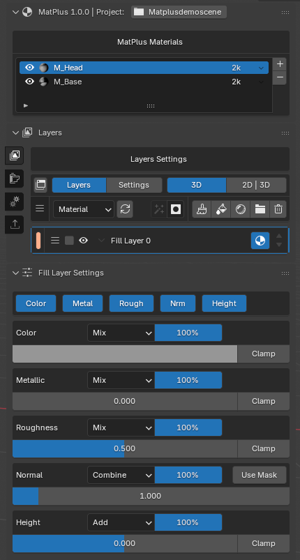
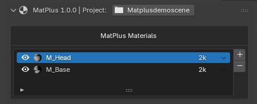
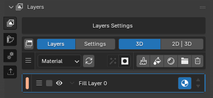
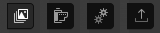
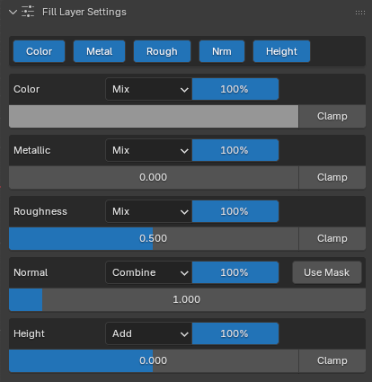
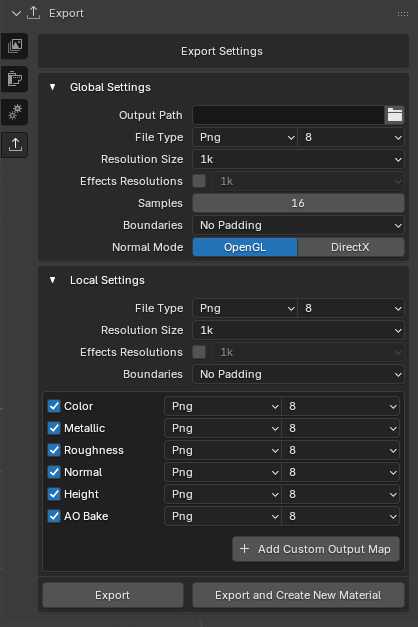

# Descripción general de la interfaz

## Layers section

Cuando creamos o abrimos un proyecto esta es la interfaz con la que nos vamos a encontrar.

Está separada en tres apartados.

### MatPlus Materials

En este apartado te vas a encontrar con la lista de materiales que contienen las mallas. 

Con los botones + y - puedes añadir o eliminar materiales de las mallas seleccionadas.

### Layers

En este apartado podemos encontrar todas las herramientas que nos van a permitir crear el material.

A la izquierda podemos encontrar los botones de las demás secciones.

### Layers settings

Esta parte funciona en conjunto con el apartado layers. Aqui podemos encontrar todos los valores, opciones y canales.

---

## Bake Maps section

### Bake Maps

Esta es la sección dedicada a hacer bake de los mapas de texturas.

### Bake Maps Settings

Este apartado esta dedicado a la configuración de los bakes tales como la resolución o las mallas high poly seleccionadas. 

### Maps settings

En esta seccion podemos elegir los mapas que van a hacerse bake. 

Justo debajo estan los botones para previsualizar/editar y para comenzar a hacer el bake.

### Información del bake

Esta parte nos proporciona toda la información necesaria sobre el bake y la configuración que tengamos en el momento.

---

## Settings section

### Quality Settings

Aqui vamos a poder configurar todas las opciones de calidad que podemos elegir para las texturas y para el viewport.

---

## Export section

### Export Settings

Aqui vamos a poder configurar todas las opciones que nos brinda el addon para poder exportar las texturas correctamente.

