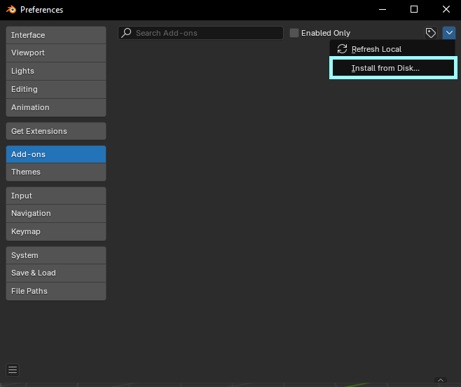
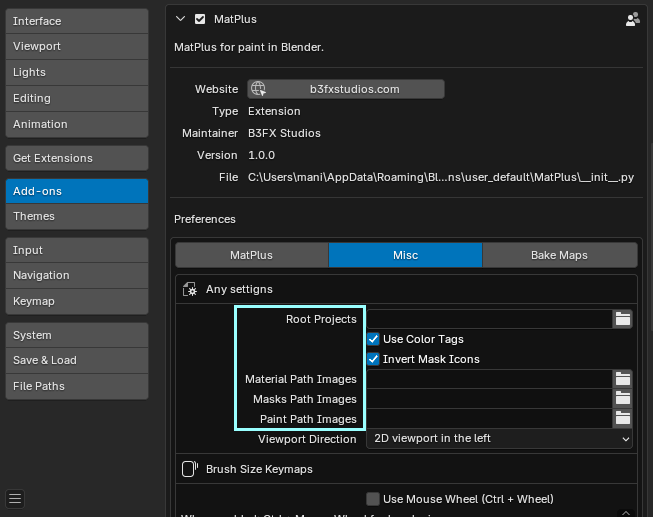

# Instalación de MatPlus #

## Requisitos ##

A continuación se indican qué versiones de Blender puedes usar para cada versión de Matplus.

| MatPlus | Blender |
|-----------|-----------|
| 1.0.0   | 4.5.1 LTS   |

Todas las versiones de MatPlus son compatibles con Windows, Mac y Linux.

## Descarga

Puedes descargar MatPlus desde el [panel de tu cuenta](https://blendermarket.com/account/orders) en Superhive una vez que lo hayas comprado.

Los archivos necesarios para la instalación son:

* MatPlus_1.0.0.zip
* AmbientCG.part1.rar
* AmbientCG.part2.rar
* AmbientCG.part3.rar
* AmbientCG.part4.rar
* AmbientCG.part5.rar
* AmbientCG.part6.rar
* Brushes And Icons.zip
* MatPlusMasks.zip

Excepto el archivo *MatPlus_1.0.0.zip*. Tienes que descomprimir el resto de archivos en una carpeta para luego configurar la ruta más tarde dentro del addon.

## Instalación
La forma más sencilla de instalar Matplus es hacerlo directamente en Blender. Puedes hacerlo en Edición > Preferencias > Complementos. Ve a la flecha desplegable en la esquina superior derecha del editor y selecciona "Install from disk".

Esto abrirá el Explorador de archivos de Blender, donde podrás buscar y seleccionar el archivo zip que descargaste.

Pulsa "Install from disk".

Una vez instalado, dentro de la configuración del addon vas a tener que configurar las rutas de las carpetas donde antes descomprimistes los archivos en la sección de descarga. 

Para hacerlo ve a Edición > Preferencias > Complementos > Matplus > Misc. 

Configura las siguientes opciones:

Root Projects

!!! example ""
    Carpeta donde se crearán y guardarán tus proyectos MatPlus, junto con todos los archivos que genera.

Material Path Images    

!!! example ""
    Carpeta donde extraerás los materiales descargados de AmbientCG para que MatPlus pueda utilizarlos.

Mask Path Images

!!! example ""
    Carpeta donde extraerás las texturas de la máscara para que MatPlus pueda acceder a ellas.

Paint Path Images

!!! example ""
    Carpeta donde extraerás las texturas, iconos, pinceles, etc., que utilizarás para pintar dentro de MatPlus.
