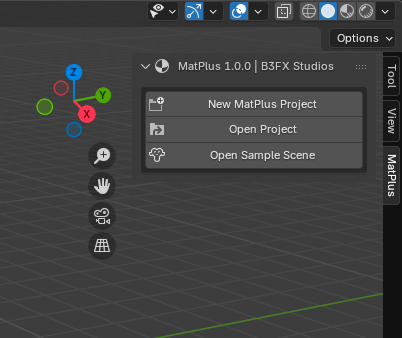
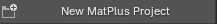
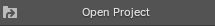
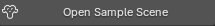

# Inicio rápido

Para empezar a usar MatPlus, solo necesitas desplegar la barra lateral y podras elegir entre tres opciones.

### Nuevo proyecto de MatPlus

Este botón inicia un proyecto nuevo completamente desde cero con las mallas que tengas seleccionadas.

### Abrir proyecto

Este botón te permite abrir un proyecto de MatPlus.

### Abrir escena de ejemplo

Este botón te abre un proyecto de prueba en blender con un modelo configurado para que puedas probar el addon.

 *Los cambios realizados en este proyecto no se conservan.*