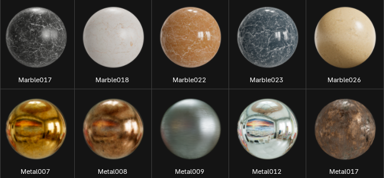
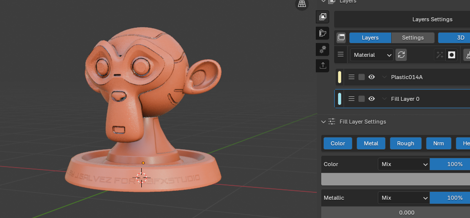

# Manual de referencia de MatPlus 1.0.0

Bienvenidos al manual de MatPlus, el conjunto de herramientas para la creación de materiales PBR.

## Secciones

-   { width="100%" }  
    **Primeros pasos**  
    Una introducción a la instalación y configuración de MatPlus.  
    [:material-arrow-right: Ver más](MatPlus/getting-started/install.md)

-   { width="100%" }  
    **Editores**  
    Resumen de la interfaz y la funcionalidad de los editores.  
    [:material-arrow-right: Ver más](RDBlab/getting-started/install.md)

-   { width="100%" }  
    **Materiales**  
    Materiales y como crearlos. 
    [:material-arrow-right: Ver más](proyectos/proyecto3.md)

-   { width="100%" }  
    **Texturizado**  
    Técnicas de texturizado.  
    [:material-arrow-right: Ver más](proyectos/proyecto4.md)

