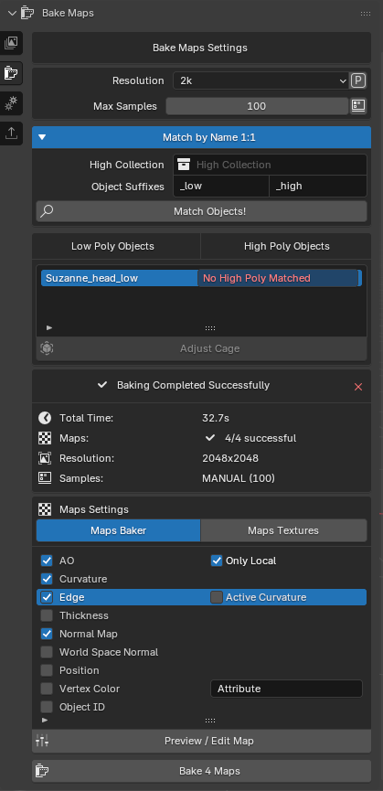
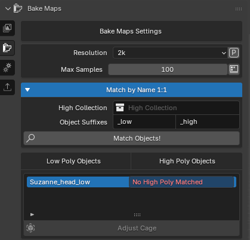
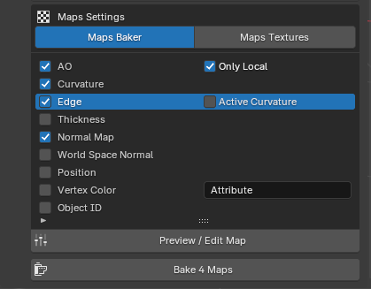
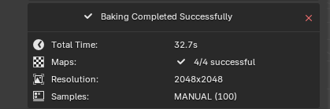

# Descripción general de la interfaz

## Bake Maps section

### Bake Maps

Esta es la sección dedicada a hacer bake de los mapas de texturas.

### Bake Maps Settings

Este apartado esta dedicado a la configuración de los bakes tales como la resolución o las mallas high poly seleccionadas. 

### Maps settings

En esta seccion podemos elegir los mapas que van a hacerse bake. 

Justo debajo estan los botones para previsualizar/editar y para comenzar a hacer el bake.

### Información del bake

Esta parte nos proporciona toda la información necesaria sobre el bake y la configuración que tengamos en el momento.

