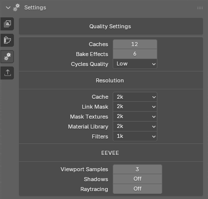

# Descripción general de la interfaz

## Settings section

### Quality Settings

Aqui vamos a poder configurar todas las opciones de calidad que podemos elegir para las texturas y para el viewport.

