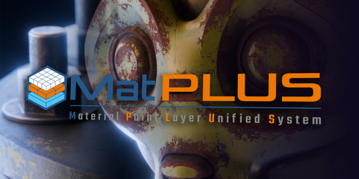
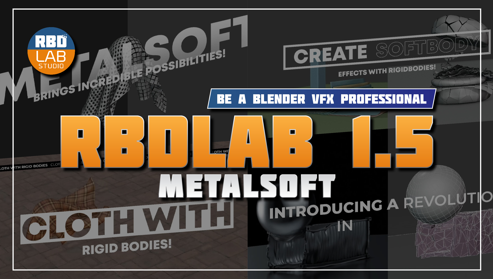
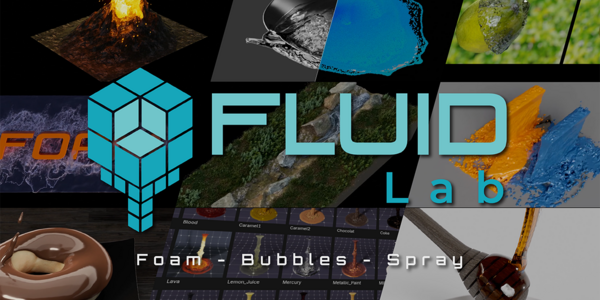
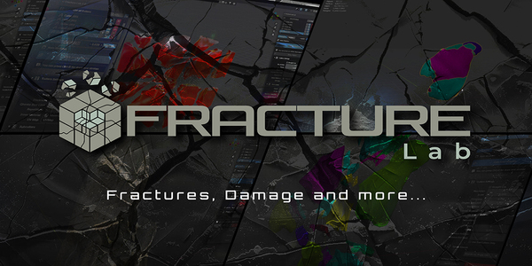
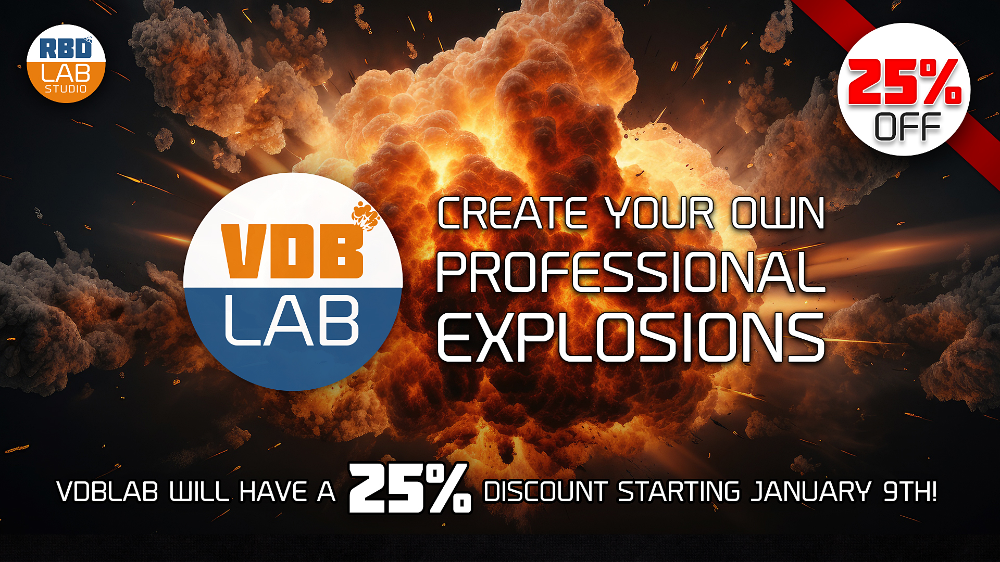

---
hide:
  - navigation
  - toc
---

# Documentación

-   { width="100%" }  
    **MatPlus**  
    Diseño de materiales.  
    [:material-arrow-right: Ver más](MatPlus/getting-started/install.md)

-   { width="100%" }  
    **RBDlab**  
    Simulaciones realistas.  
    [:material-arrow-right: Ver más](RDBlab/getting-started/install.md)

-   { width="100%" }  
    **Fluidlab**  
    Simulaciones de liquidos.  
    [:material-arrow-right: Ver más](proyectos/proyecto3.md)

-   { width="100%" }  
    **Fracturelab**  
    Simulaciones de fracturas.  
    [:material-arrow-right: Ver más](proyectos/proyecto4.md)

-   { width="100%" }  
    **VDBlab**  
    Simulaciones de explosiones.  
    [:material-arrow-right: Ver más](proyectos/proyecto5.md)

